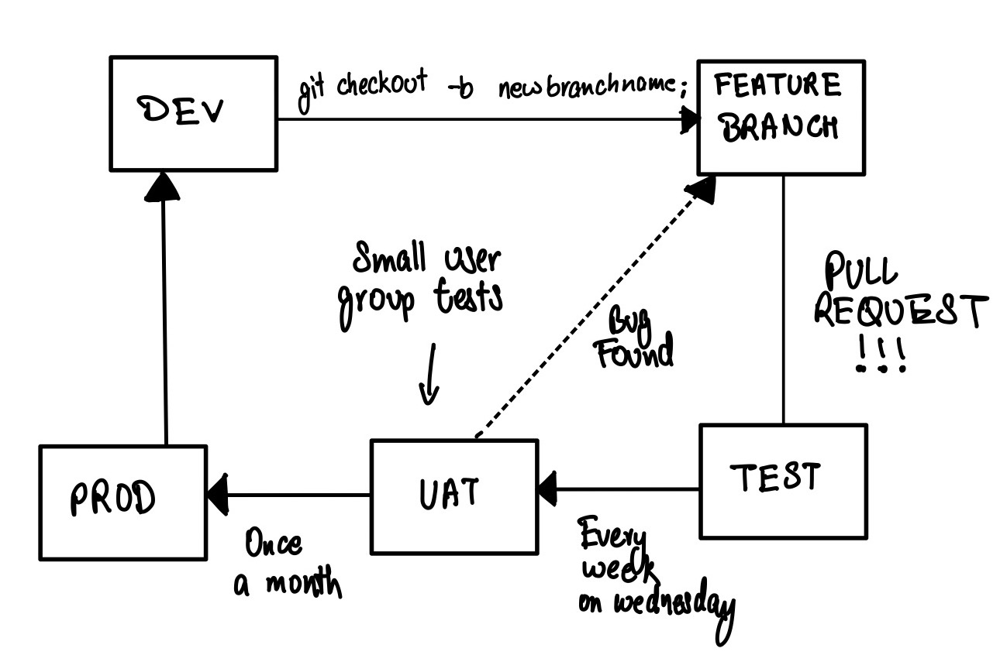
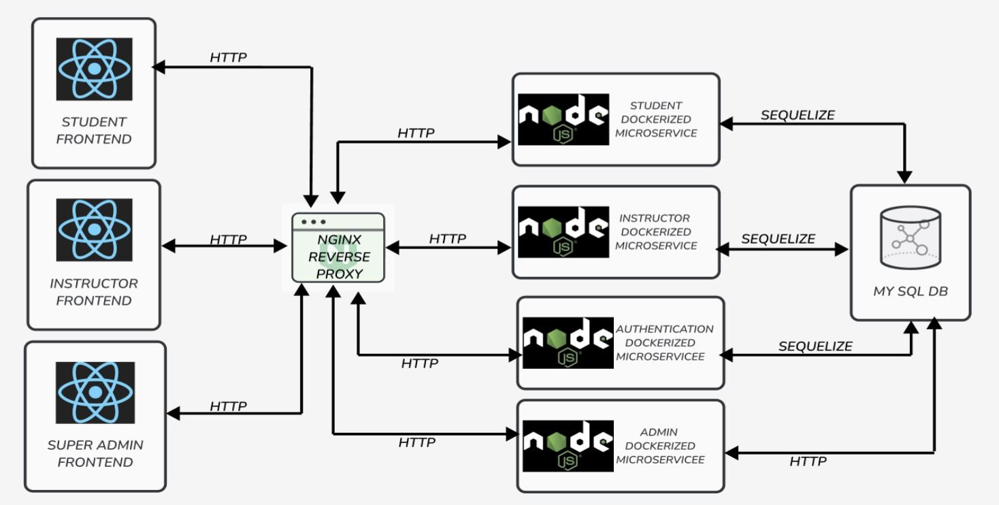

[](https://classroom.github.com/a/zEIKTSl7)
[](https://classroom.github.com/online_ide?assignment_repo_id=11214028&assignment_repo_type=AssignmentRepo)

# Peer Review Application

Our project, the Peer Review Application, is designed to transform the way we approach collaborative learning and assessment within educational environments.
The project tries to solve the problem of trying to evaluate each other's contribution for a group assignment , and the instructor being able to create and assign Evaluations for the group members to evaluate each other on. Which facilitates collaborative learning , and continuous feedback for students, in a course.
The students can register and anonymously evaluate other students in a group, while an instructor can view the results from those evaluations. Instructors can also create Assignments for students enrolled in a course to finish, and then can view the results of those submissions.

Our Project Client is Parsa Rajabi, a UBCO graduate and is currently pursuing his masters degree in computer science at Simon Fraser university. Parsa’s research is mostly based on computer science education; How students learn Computer Science and how to improve the teaching methods to educate Computer science to students.

## Folder Structure

```
.
├── docs # All the Documentation files are in this folder
│ ├── scope_and_charter # Scope and Charter
│ ├── design # Design and Testing Document
│ ├── final # Final Report can be found here
│ ├── logs # Team Logs (weekly team logs and personal team logs)
│ └── ...
├── database (includes all the files related to te database, e.g. ER diagrams, init files, etc)
├── express_microservices (Sourse files for our backend microservices)
├── frontend (Source files for our 3 frontend applications)
└── README.md

```

## Running the docker containors

-   Make sure docker is running.
-   In the directory `capstone_project` run ` docker compose up -d` , supports hot reload;
    -   For front end apps , just need to refresh the browser to pick up new changes.
    -   For Backend go to Containor logs , if it says there is an error , simply restart the contianor.

### Debugging Docker run issue

1. Network pool overlaps - Run ` docker network ls` , select the network id for the network that you do not use , then run ` docker network remove #networkId` . Then re run ` docker compose up -d`.

2. Error : `  Pool overlaps with other one on this address space`. Check no other containor is runnig on the ports. If they are delete them , and run `docker compose up` again.

3. Port already in use - Run `lsof -i:portNum` , get the PID , and run

## Feature Development Github workflow:

Please only follow the branch workflow below.



## Architecture of the App :

Instructor - React JS App

Student - React JS App

Admin - React JS App

Microservices - Express Js Microservices



## Deploying the app in Production

Run the following command , to deploy all the docker containors in production environment : `docker compose -f docker-compose.prod.yaml up -d`.

```

```
